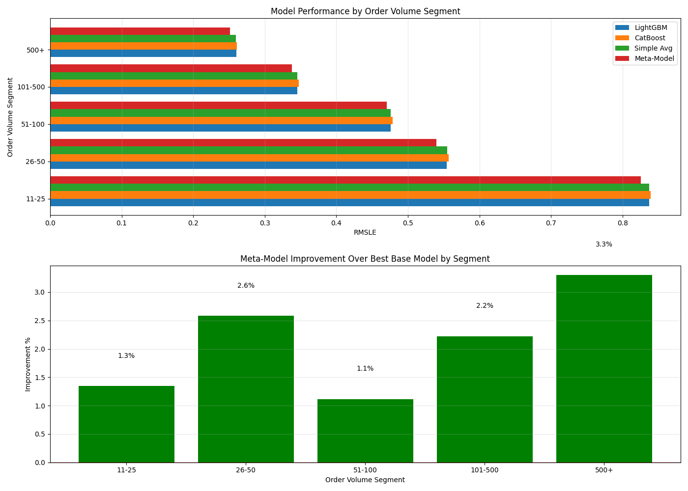
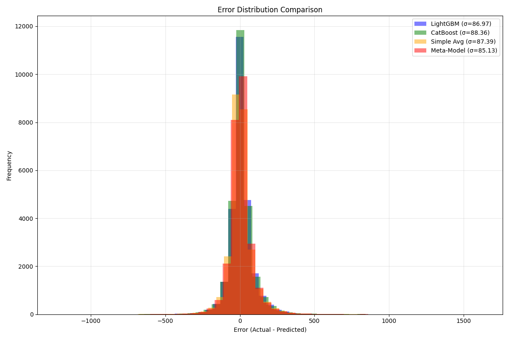
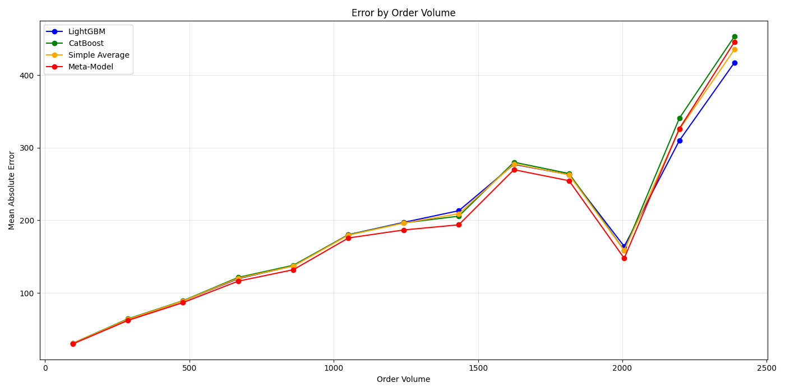
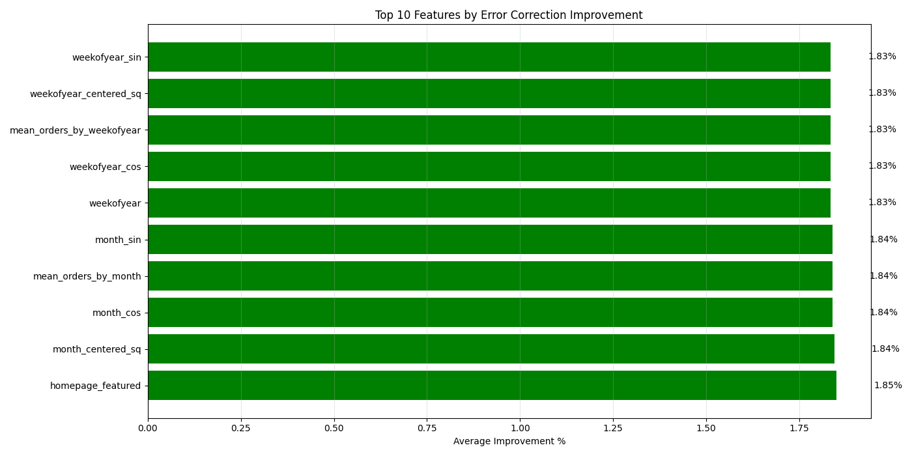
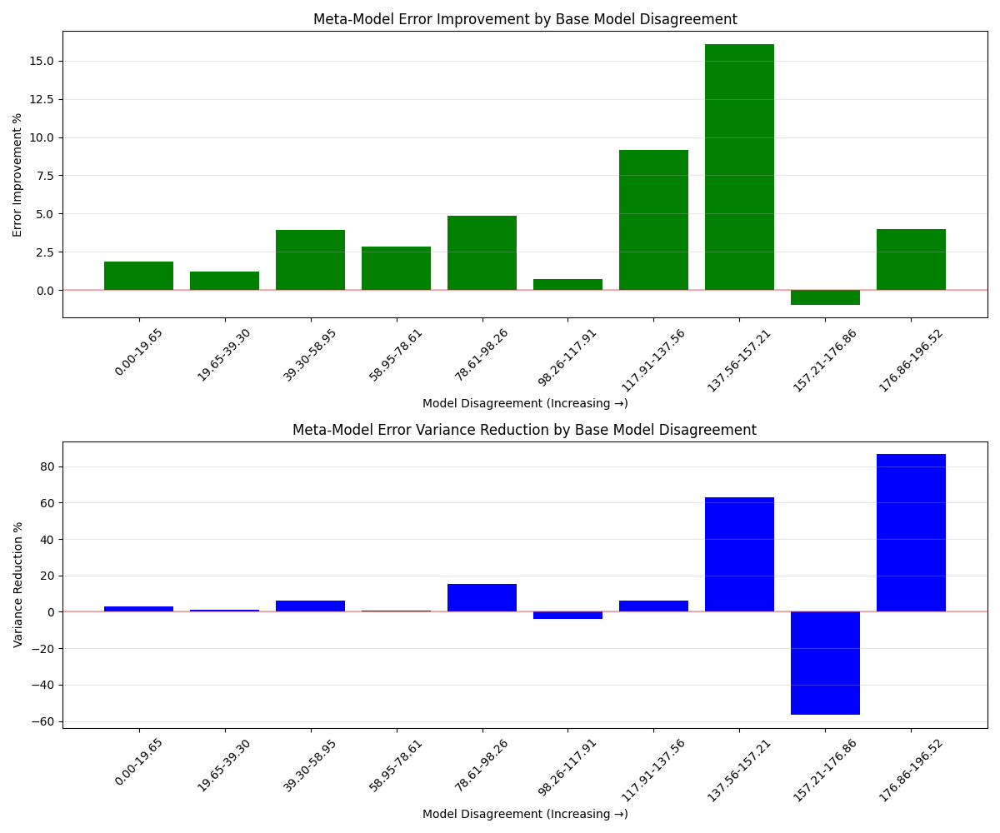
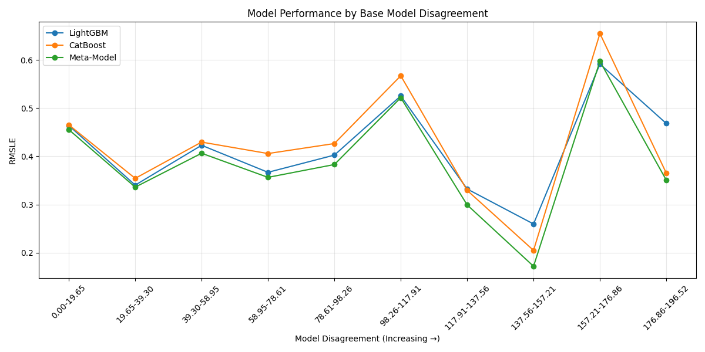

# Ensemble Model Performance Report

Generated on: 2025-05-13 00:26:03

## Overall Performance

| Model | Validation RMSLE |
|-------|----------------:|
| LightGBM | 0.45720 |
| CatBoost | 0.45933 |
| Simple Average | 0.45735 |
| Stacking Ensemble | 0.44870 |

Ensemble provides **1.86%** improvement over best base model

## Segment Analysis

| Segment | Count | % of Data | Avg Volume | LightGBM | CatBoost | Simple Avg | Meta-Model | Improvement |
|---------|------:|----------:|-----------:|---------:|---------:|-----------:|-----------:|------------:|
| 11-25 | 2142 | 8.2% | 14.0 | 0.83686 | 0.83903 | 0.83725 | 0.82561 | 1.34% |
| 26-50 | 3784 | 14.4% | 33.7 | 0.55414 | 0.55704 | 0.55459 | 0.53984 | 2.58% |
| 51-100 | 5248 | 20.0% | 72.4 | 0.47576 | 0.47858 | 0.47609 | 0.47045 | 1.12% |
| 101-500 | 11960 | 45.5% | 238.9 | 0.34559 | 0.34755 | 0.34555 | 0.33790 | 2.22% |
| 500+ | 3131 | 11.9% | 822.7 | 0.26021 | 0.26071 | 0.25960 | 0.25162 | 3.30% |

## Key Findings

- Ensemble performs best in the **500+** orders segment with **3.30%** improvement
- Ensemble performs worst in the **51-100** orders segment with **1.12%** improvement

### Best Model by Segment

- **11-25**: Meta-Model (RMSLE: 0.82561)
- **26-50**: Meta-Model (RMSLE: 0.53984)
- **51-100**: Meta-Model (RMSLE: 0.47045)
- **101-500**: Meta-Model (RMSLE: 0.33790)
- **500+**: Meta-Model (RMSLE: 0.25162)

## Visualizations

### Model Performance by Segment

### Error Distribution

### Error by Volume

## Feature-wise Error Correction Analysis

### Top 10 Features by Error Correction Effectiveness

| Feature | Avg Improvement | Best Bin | Best Improvement | Worst Bin | Worst Improvement |
|---------|---------------:|----------|------------------|-----------|------------------:|
| homepage_featured | 1.85% | 1 | 2.23% | 0 | 1.82% |
| month_centered_sq | 1.84% | 0.47928994082840237 | 2.19% | 0.7159763313609467 | 1.63% |
| month_cos | 1.84% | 0.8660254037844384 | 2.19% | 1.0 | 1.56% |
| mean_orders_by_month | 1.84% | 239.9223838865013 | 2.19% | 270.4825967424007 | 1.56% |
| month_sin | 1.84% | -0.5000000000000004 | 2.19% | -2.4492935982947064e-16 | 1.56% |
| weekofyear | 1.83% | 34 | 2.42% | 40 | 1.20% |
| weekofyear_cos | 1.83% | -0.5680647467311559 | 2.42% | 0.1205366802553232 | 1.20% |
| mean_orders_by_weekofyear | 1.83% | 228.88317267393126 | 2.42% | 262.080920641533 | 1.20% |
| weekofyear_centered_sq | 1.83% | 0.09467455621301775 | 2.42% | 0.28994082840236685 | 1.20% |
| weekofyear_sin | 1.83% | -0.8229838658936564 | 2.42% | -1.0 | 1.42% |

## Ensemble Stability Analysis

The ensemble model shows an average error improvement of **4.36%** and error variance reduction of **12.11%** compared to the best base model.

### Stability by Model Disagreement

When base models disagree more, the meta-model provides the following benefits:

### Key Stability Insights

- Highest error improvement (16.08%) occurs when models disagree by 148.49 units
- Highest variance reduction (86.45%) occurs when models disagree by 183.98 units
